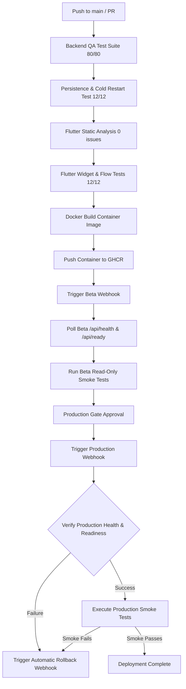

# NABIN Platform — Production & Beta Deployment Specification

This document defines the automated deployment architecture, GitHub Actions pipeline, deployment webhook contracts, health/readiness probe requirements, and rollback protocol for the **NABIN Super-App Platform**.

---

## 1. Required GitHub Actions Secrets

Configure these secrets in your GitHub repository under **Settings $\rightarrow$ Secrets and variables $\rightarrow$ Actions**:

| Secret Name | Scope | Description |
| :--- | :--- | :--- |
| `BETA_DEPLOY_WEBHOOK_URL` | Beta Deploy | HTTPS webhook URL on your beta hosting environment that triggers pulling and restarting the container. |
| `BETA_API_URL` | Beta Verification | Base URL of the deployed Beta API (e.g. `https://api-beta.nabin.in`). |
| `PROD_DEPLOY_WEBHOOK_URL` | Prod Deploy | HTTPS webhook URL on your production hosting environment that executes a rolling update. |
| `PROD_API_URL` | Prod Verification | Base URL of the live Production API (e.g. `https://api.nabin.in`). |
| `PROD_ROLLBACK_WEBHOOK_URL`| Rollback Trigger | HTTPS webhook URL invoked when health, readiness, or smoke tests fail on production. |

---

## 2. CI/CD Deployment Pipeline Flow

The GitHub Actions workflow in [`.github/workflows/ci_cd.yml`](../.github/workflows/ci_cd.yml) executes the following end-to-end verification gate:



---

## 3. Deployment Webhook Contracts

### A. Deploy Webhook Contract (Beta & Production)
When triggering a deployment, GitHub Actions dispatches an authenticated HTTP POST request to `BETA_DEPLOY_WEBHOOK_URL` or `PROD_DEPLOY_WEBHOOK_URL`.

#### Request Format:
```http
POST /deploy-webhook HTTP/1.1
Host: your-hosting-orchestrator.com
Content-Type: application/json
Authorization: Bearer <WEBHOOK_BEARER_SECRET>

{
  "image": "ghcr.io/macmillanch/nabin-backend:<COMMIT_SHA>",
  "environment": "beta",
  "ref": "refs/heads/main",
  "sha": "<COMMIT_SHA>",
  "previousSha": "<PREVIOUS_COMMIT_SHA>"
}
```

#### Hosting Orchestrator Expected Workflow:
1. Authenticate the incoming request using a bearer secret or HMAC signature.
2. Authenticate against `ghcr.io` and pull `ghcr.io/macmillanch/nabin-backend:<COMMIT_SHA>`.
3. Perform a zero-downtime rolling replacement of the running Node.js container instance.
4. Pass required production environment variables:
   - `NODE_ENV=production`
   - `PORT=4000`
   - `SUPABASE_URL=https://<your-ref>.supabase.co`
   - `SUPABASE_SERVICE_ROLE_KEY=<service-role-key>`
   - `REDIS_URL=redis://...`
5. Verify container local health via `HEALTHCHECK` (`/api/health`).
6. Return **HTTP 200/202** with `{ "success": true, "status": "DEPLOYED", "sha": "<COMMIT_SHA>" }`.

---

### B. Rollback Webhook Contract (Production Failure)
If post-deployment health probes (`/api/health`), database readiness checks (`/api/ready`), or smoke tests fail, GitHub Actions immediately invokes `PROD_ROLLBACK_WEBHOOK_URL`.

#### Request Format:
```http
POST /rollback-webhook HTTP/1.1
Host: your-hosting-orchestrator.com
Content-Type: application/json
Authorization: Bearer <WEBHOOK_BEARER_SECRET>

{
  "action": "rollback",
  "environment": "production",
  "failedSha": "<FAILED_COMMIT_SHA>",
  "previousSha": "<PREVIOUS_COMMIT_SHA>"
}
```

#### Hosting Orchestrator Expected Workflow:
1. Re-deploy the previously running image (`ghcr.io/macmillanch/nabin-backend:<PREVIOUS_COMMIT_SHA>`).
2. Verify `/api/health` and `/api/ready` on the rolled-back container.
3. Return **HTTP 200** with `{ "success": true, "status": "ROLLED_BACK", "activeSha": "<PREVIOUS_COMMIT_SHA>" }`.

---

## 4. Health Check & Readiness Endpoints

The NABIN Backend provides two standard health and readiness endpoints:

### 1. Process Liveness (`GET /api/health`)
- **Purpose**: Verifies that the Express process is running, event loop is responsive, and background dispatch worker is listening.
- **Response**: `HTTP 200 OK`
```json
{
  "status": "ONLINE",
  "uptime": 1420.5,
  "timestamp": "2026-08-23T07:30:00.000Z",
  "version": "1.0.0",
  "activeDrivers": 6
}
```

### 2. Dependency Readiness (`GET /api/ready`)
- **Purpose**: Verifies that PostgreSQL / Supabase connection is established, double-entry financial ledger tables exist, and Redis cache is reachable.
- **Fail-Closed Behavior**: In `production` (`NODE_ENV=production`), if database connectivity is lost or unconfigured, this endpoint returns `HTTP 503 Service Unavailable` with `ready: false`.
- **Response**: `HTTP 200 OK`
```json
{
  "ready": true,
  "database": "CONNECTED",
  "persistence": "SUPABASE_POSTGRESQL",
  "timestamp": "2026-08-23T07:30:00.000Z"
}
```

---

## 5. Automated Read-Only Smoke Tests

The smoke test suite ([`backend/smoke_test.js`](../backend/smoke_test.js)) tests only safe, read-only endpoints without creating test users, mock rides, or altering ledger balances:
- `GET /api/health`
- `GET /api/ready`
- `GET /api/services/status`
- `GET /api/v1/features`

---

## 6. Render.com Step-by-Step Setup Guide

Render is a fully managed cloud platform that natively supports our Docker container and provides zero-downtime rolling deployments and automated Deploy Hooks.

### Option A: Deploy via Render Blueprints (Recommended)
1. Log in to [Render Dashboard](https://dashboard.render.com/).
2. Click **New +** $\rightarrow$ **Blueprint**.
3. Connect your GitHub repository: `https://github.com/macmillanch/NABIN`.
4. Render will automatically detect [`render.yaml`](../render.yaml) and configure the `nabin-backend-prod` Web Service.
5. In the configuration screen, populate your secret environment variables:
   - `SUPABASE_URL`: Your Supabase Project URL (`https://<project-ref>.supabase.co`).
   - `SUPABASE_SERVICE_ROLE_KEY`: Your Supabase Service Role Secret Key.
   - `SUPABASE_ANON_KEY`: Your Supabase Anon Public Key.
   - `REDIS_URL`: Your Redis connection string (e.g. Upstash Redis or Render Redis).
6. Click **Apply**.

---

### Option B: Deploy as a Standalone Web Service (Manual)
1. In Render Dashboard, click **New +** $\rightarrow$ **Web Service**.
2. Select **Build and deploy from a Git repository** and pick `NABIN`.
3. Configure the service settings:
   - **Name**: `nabin-backend`
   - **Region**: `Singapore` (or nearest to your users)
   - **Branch**: `main`
   - **Runtime**: `Docker`
   - **Dockerfile Path**: `./backend/Dockerfile`
   - **Docker Context**: `./backend`
   - **Health Check Path**: `/api/health`
4. Add Environment Variables:
   - `NODE_ENV` = `production`
   - `PORT` = `4000` (or leave default; Render binds automatically)
   - `SUPABASE_URL` = `https://<ref>.supabase.co`
   - `SUPABASE_SERVICE_ROLE_KEY` = `<your-service-key>`
   - `SUPABASE_ANON_KEY` = `<your-anon-key>`
   - `REDIS_URL` = `redis://...`
5. Click **Create Web Service**.

---

### How to Get Your Render Deploy Hook for GitHub Actions

1. In your Render Service dashboard, go to **Settings**.
2. Scroll down to the **Deploy Hook** section.
3. Click **Add Deploy Hook** (or copy the existing URL):
   - Example: `https://api.render.com/deploy/srv-c0123456789abcdef?key=secret_token_123`
4. Copy this URL and add it to your GitHub repository (**Settings $\rightarrow$ Secrets and variables $\rightarrow$ Actions**):
   - Set `PROD_DEPLOY_WEBHOOK_URL` = Your Render Deploy Hook URL.
   - Set `PROD_API_URL` = Your Render Service URL (e.g. `https://nabin-backend.onrender.com`).
   - Set `PROD_ROLLBACK_WEBHOOK_URL` = (Optional) Render Deploy Hook or rollback endpoint.
5. Every time you push to `main` (or trigger CI/CD), GitHub Actions will verify tests and trigger Render to deploy the verified release with zero downtime!

