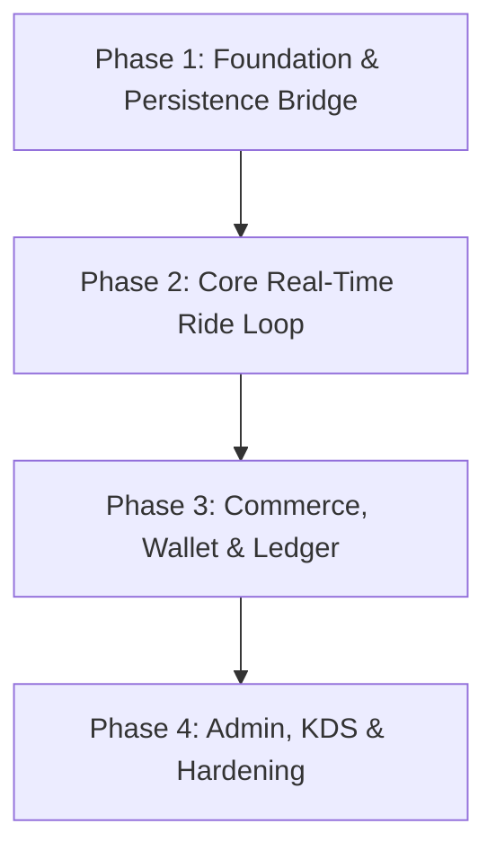

# NABIN PLATFORM — COMPREHENSIVE IMPLEMENTATION-GAP AUDIT

**Date:** 2026-09-04  
**Auditor:** Antigravity Autonomous Pair Programmer  
**Repository Working Copy:** `C:\Users\macmi\Documents\nabin`  
**Git Authoritative Baseline:** `527d5a32c08857d99b107413d25a4c74a5b8a884` (main)  
**Database Status:** Local Docker Supabase Active (`38 tables`, `516 columns`, `34 FKs`, `140 indexes`, `52 RLS policies`, `5 stored RPCs`)  
**Backend QA Status:** 148/148 Tests Passed (100%)  
**Mobile QA Status:** `flutter analyze` 0 issues, 18/18 Widget Tests Passed (100%)  

---

## Executive Summary

The NABIN platform possesses an exceptionally strong architectural foundation:
1. **Authoritative Relational Schema (PostgreSQL):** Fully realized across 14 migrations with strict normalization, financial double-entry constraints, and complete RLS policy definitions.
2. **Backend Engine (Express + Node.js):** 131 endpoint definitions covering authentication, identity/KYC review, dispatch, trip lifecycle, dual-OTP verification, dynamic surge pricing, grocery master catalogs, Cloudinary media optimization, and financial reconciliation.
3. **Super-App Mobile Frontend (Flutter 3.47):** A rich multi-modal application shell housing Customer, Driver, Restaurant (KDS), and Grocery interfaces with polished UI components, Leaflet/Flutter maps, and cohesive Stitch design tokens.
4. **Administrative Intelligence (HTML5 / Tailwind / Leaflet):** A comprehensive 7,000-line single-page application dashboard featuring executive analytics, KYC queues, live dispatch tracking, service switchboard, and surge zone editors.

### The Core Architectural Gap
Despite this extensive implementation, **the three tiers (Database, Backend, and Mobile UI) currently operate in partial isolation**:
- **Database Tier:** The 38 Supabase PostgreSQL tables and 5 stored RPC functions are healthy and tested via schema migrations, but the backend Node.js layer predominantly uses an in-memory/JSON store (`persistentStore.js`), synchronizing only 4 entities (`users`, `jobs`, `drivers`, `ledger_entries`) to PostgreSQL.
- **Backend API Tier:** 131 robust endpoints and comprehensive test suites exist, but only 4 endpoints are called from the Flutter mobile app.
- **Mobile UI Tier:** Screens feature state-of-the-art UI layouts, but ride booking, driver job dispatch, food ordering, grocery cart revalidation, and wallet balance operations rely on local widget state or hardcoded fixtures rather than live API calls.
- **WebSocket Gateway:** Real-time WebSocket clients in the mobile app attempt to register without a bearer session token, causing handshake authentication rejections on the backend.

---

## 1. Feature Implementation Matrix

| Domain | Database Schema | Backend API | Mobile Flutter UI | Admin Web Dashboard | End-to-End Live Status |
|---|:---:|:---:|:---:|:---:|:---:|
| **Auth & Phone OTP** | ✅ Complete (`users`, `active_sessions`) | ✅ Complete (`/api/auth/*`) | ✅ Live (`phone_entry`, `otp_verification`) | ✅ Live (`/api/admin/login`) | **FULLY FUNCTIONAL** |
| **Admin RBAC & Audit** | ✅ Complete (`admin_accounts`, `audit_logs`) | ✅ Complete (`/api/admin/*`) | ⚠️ Backend-only | ✅ Live (`admin_dashboard.html`) | **FULLY FUNCTIONAL** |
| **Identity & KYC Review** | ✅ Complete (`identity_documents`) | ✅ Complete (`/api/identity/*`, `/api/admin/identity-verifications/*`) | 🔶 Simulated UI (900ms delay) | ✅ Live KYC Queue | **PARTIAL (UI Unwired)** |
| **Ride Booking & Lifecycle** | ✅ Complete (`jobs`, `geo_fences`) | ✅ Complete (`/api/customer/book-ride`, `/api/driver/*`) | 🔶 Hardcoded vehicle push | ✅ Live monitoring | **PARTIAL (UI Unwired)** |
| **School Ride Pass** | ✅ Complete (`user_delegates`, `jobs`) | ✅ Complete (`/api/schools`, `/api/children`) | 🔶 Local repository only | ⚠️ API only | **PARTIAL (Local UI only)** |
| **Driver Dispatch & Map** | ✅ Complete (`dispatch_offers`, `drivers`) | ✅ Complete (`/api/v1/driver/location`, WS broadcast) | 🔶 Simulated dispatch in UI | ✅ Live Leaflet Fleet Map | **PARTIAL (WS Token Gap)** |
| **Food & Restaurant (KDS)** | ✅ Complete (`merchants`, `products`) | ✅ Complete (`/api/merchant/*`, `/api/customer/book-food`) | 🔶 Hardcoded KDS / Menu | ⚠️ Minimal admin | **PARTIAL (UI Unwired)** |
| **Grocery Quick Commerce** | ✅ Complete (`master_grocery_catalog`, `merchant_grocery_inventory`) | ✅ Complete (`/api/grocery/*`, `/api/admin/master-catalog/*`) | 🔶 Hardcoded Cart / Products | ✅ Live Master Catalog Editor | **PARTIAL (UI Unwired)** |
| **Parcel Courier (Dual-OTP)** | ✅ Complete (`jobs`, proof storage) | ✅ Complete (`/api/customer/book-parcel`, `/api/parcel/*/delivery-proof`) | 🔶 Simulated form submission | ⚠️ API only | **PARTIAL (UI Unwired)** |
| **Payment Gateway & Checkout** | ✅ Complete (`payments`, `payment_sessions`, `checkouts`) | ✅ Complete (`/api/payments/*`, `/api/checkout/*`) | 🔶 Local balance increment | ⚠️ API only | **PARTIAL (UI Unwired)** |
| **Double-Entry Ledger** | ✅ Complete (`ledger_accounts`, `ledger_entries`, `journal_*`) | ✅ Complete (`/api/admin/finance/*`) | 🔶 Hardcoded history | ✅ Live Ledger Table | **PARTIAL (UI Unwired)** |
| **Wallet & Payouts** | ✅ Complete (`adjust_wallet_atomic`, `driver_payouts`) | ✅ Complete (`/api/driver/payout`, `/api/admin/finance/*`) | 🔶 Hardcoded balance & dialog | ✅ Live Adjustment Tool | **PARTIAL (UI Unwired)** |
| **Promotions & Coupons** | ✅ Complete (`promotions`, `redeem_promotion_atomic`) | ✅ Complete (`/api/promotions/apply`, `/api/admin/promotions`) | 🔶 Client-side promo text | ✅ Live Promotion Editor | **PARTIAL (UI Unwired)** |
| **Support & Disputes** | ✅ Complete (`support_tickets`) | ✅ Complete (`/api/support/*`, `/api/admin/support/*`) | ✅ Live (`customer_support_screen`) | ✅ Live Dispute Resolver | **FULLY FUNCTIONAL** |
| **Geofencing & Surge** | ✅ Complete (`geo_fences`, `surge_zones`, `pricing_configurations`) | ✅ Complete (`/api/geofence/*`, `/api/pricing/estimate`) | 🔶 Static map view | ✅ Live Leaflet Zone Editor | **PARTIAL (Mobile Map Unwired)** |
| **Notifications & Tokens** | ✅ Complete (`notification_templates`, `notifications`, `device_tokens`) | ⚠️ Minimal endpoints | ❌ No notification screen | ⚠️ Minimal | **INCOMPLETE** |
| **Media & Cloudinary** | ✅ Complete (Storage & sensitive KYC guard) | ✅ Complete (`/api/media/*`, `/api/customer/profile/photo`, etc.) | 🔶 Simulated upload | ⚠️ API only | **BACKEND ONLY** |

---

## 2. Detailed Gap Categorization

### A. Fully Implemented Features (End-to-End Live)
1. **Centralized Phone OTP Authentication:**
   - Mobile `PhoneEntryScreen` -> `NabinApiService.sendOtp` -> Backend `/api/auth/send-otp` -> Mock SMS dispatch with 300s TTL.
   - Mobile `OtpVerificationScreen` -> `NabinApiService.verifyOtp` -> Backend `/api/auth/verify-otp` -> Token generation -> `SessionManager.setToken`.
2. **Support & Dispute Resolution Flow:**
   - Mobile `CustomerSupportScreen` -> `NabinApiService.submitSupportTicket` -> Backend `POST /api/support/ticket` -> Audit log record.
   - Admin `admin_dashboard.html` Support tab -> Live ticket resolution -> Wallet refund credit / Driver safety freeze.
3. **Admin Authentication & RBAC Switchboard:**
   - Admin login (`/api/admin/login`) with bcrypt hash comparison and role permission enforcement.
   - Live platform emergency switchboard (`/api/admin/services/pause`, `/api/admin/services/resume`, `/api/admin/services/emergency-killswitch`).

---

### B. Partially Implemented Features
1. **Identity & KYC Submission:**
   - Backend endpoint `POST /api/identity/submit` accepts documents, creates pending KYC records, and enforces unverified ride blocking.
   - Mobile `IdentityVerificationSubmissionScreen` simulates upload with a 900ms `Future.delayed` timer instead of submitting multipart documents to `POST /api/identity/submit`.
2. **Dynamic Surge & Pricing Engine:**
   - Backend endpoint `POST /api/pricing/estimate` calculates point-in-polygon containment, applies dynamic surge multipliers (1.5x), and includes toll surcharges.
   - Mobile `RideBookingScreen` displays fixed vehicle fares (₹45, ₹85, ₹160) rather than requesting dynamic estimates from `NabinApiService.calculateFareEstimate`.
3. **Driver Location Telemetry:**
   - Backend endpoint `POST /api/v1/driver/location` stores driver locations in high-frequency cache.
   - Mobile `DriverAppShell` has map controllers, but does not stream GPS coordinates to `/api/v1/driver/location` periodically.

---

### C. Backend-Only Features Lacking Mobile UI
1. **Payment Gateway Checkout:**
   - Backend has production-grade order creation (`/api/payments/create-order`), checkout signature verification (`/api/payments/verify-checkout`), and double-entry escrow ledger recording.
   - Mobile has no Razorpay / UPI SDK bridge; checkout screens simply display static confirmations.
2. **Cloudinary Profile & Vehicle Photo Management:**
   - Backend has 14 dedicated media endpoints with auto-WebP conversion, thumbnail generation, and strict KYC document isolation.
   - Mobile profile and vehicle registration screens do not invoke camera/gallery image pickers or upload to `/api/media/upload`.
3. **Grocery Price History & Stock Alerts:**
   - Backend tracks price changes in `grocery_price_history` and flags price surges.
   - Mobile customer grocery UI does not display price history badges.

---

### D. UI-Only Features Lacking Backend Integration
1. **School Child Ride Pass (Guardian & Student Profile):**
   - Flutter has comprehensive data models (`ChildModel`, `SchoolModel`, `PassengerBookingInfo`) and UI forms in `RideBookingScreen` for school timing offsets, guardian contact, and child photos.
   - Backend has basic `/api/schools` and `/api/children` in-memory endpoints, but the mobile UI does not persist or fetch school children from the backend API.
2. **Food Order KDS Pipeline:**
   - `RestaurantMainShell` has a multi-stage Kitchen Display System (New -> Accepted -> Preparing -> Ready -> Picked Up).
   - Order transitions in the UI update local widget state rather than dispatching `POST /api/merchant/:restaurantId/orders/:orderId/status`.
3. **Driver Multi-Service Toggles:**
   - `DriverAppShell` has UI toggles for "Allow Rides", "Allow Parcels", and "Allow Food".
   - These preference states are not synced to `drivers.service_capabilities` in the backend.

---

### E. Missing API Endpoints
1. **Customer Notification Inbox:**
   - `GET /api/notifications`: Retrieve paginated notifications for the logged-in user.
   - `PUT /api/notifications/:id/read`: Mark a specific notification as read.
   - `POST /api/notifications/device-token`: Register FCM/APNS push notification device token.
2. **Customer Saved Addresses / Favorites:**
   - `GET /api/user/saved-locations`: List home, work, and custom favorite addresses.
   - `POST /api/user/saved-locations`: Save a new geocoded location (backing table `user_saved_locations` already exists in PostgreSQL).
3. **Driver Daily Shift Summary:**
   - `GET /api/driver/:id/shift-summary`: Returns completed trips, distance driven, gross fares, platform deductions, and net cash-in-hand for the active shift.

---

### F. Missing Database Integration (Persistence Gap)
1. **Supabase PostgreSQL Connection in Development:**
   - `backend/.env` is absent; `backend/src/supabase.js` falls back to `DEVELOPMENT_LOCAL_MODE` because `SUPABASE_URL` and `SUPABASE_ANON_KEY` are not loaded.
   - Resolution: Create local `backend/.env` pointing to `http://127.0.0.1:54321` with local Supabase keys.
2. **Unused PostgreSQL Tables (34 of 38 tables):**
   - `checkouts` & `checkout_events`: All checkout operations exist only in volatile server memory.
   - `dispatch_offers`: Dispatch broadcasting does not persist offers or TTL expirations into PostgreSQL.
   - `geo_fences` & `surge_zones`: Defined in migration 011, but server queries memory arrays.
   - `promotions` & `promotion_redemptions`: Server uses memory map instead of table rows.
   - `support_tickets`: Audit trail and resolution history are kept in memory and JSON store.
3. **Unused PostgreSQL Stored RPC Functions (5 of 5):**
   - `adjust_wallet_atomic`: Wallet modifications occur in JavaScript without calling PostgreSQL atomic transactions.
   - `capture_payment_atomic`: Payment capture updates JS state instead of database atomic RPC.
   - `redeem_promotion_atomic`: Promo usage limits are checked in JS instead of the database constraint function.
   - `refund_payment_atomic`: Refund accounting is calculated in Node instead of PostgreSQL.
   - `validate_promotion_preview`: Validation executes in server route instead of RPC.

---

### G. Broken or Incomplete User Flows
1. **Customer Ride Booking -> Driver Job Dispatch Flow:**
   - Customer clicks "Confirm Ride" in `RideBookingScreen` -> No API call is made -> Job is never created in backend.
   - Driver in `DriverAppShell` waits for jobs -> No job offer arrives via WebSocket -> Driver relies on `_triggerSimulatedJob`.
   - Complete break in the core customer-to-driver loop.
2. **WebSocket Handshake Authentication Failure:**
   - Backend `server.js` requires `{ type: 'AUTHENTICATE', token: '<session_token>' }` or URL query `?token=<session_token>`.
   - Flutter `nabin_ws_service.dart` sends `{ type: 'REGISTER', role: role, id: userId }` without `token`.
   - Backend strictly rejects connection with `AUTH_ERROR`.
3. **Wallet Top-Up Flow:**
   - Customer selects ₹500 top-up in `WalletScreen` -> Local widget adds ₹500 to a temporary Dart double -> No transaction record, no payment order created, no ledger entry generated.
   - Navigating away or restarting app resets balance to ₹450.00.
4. **Driver KYC & Document Upload Flow:**
   - Driver fills registration form in `DriverKycRegistrationScreen` -> Submission button is a mock callback -> Identity documents are not transmitted to backend.

---

### H. Security Gaps
1. **Session Token Persistence on Mobile:**
   - `SessionManager` stores `_authToken` in volatile static memory.
   - Force-closing or backgrounding the Flutter app destroys the session token, requiring re-login on every launch.
   - Recommended: Integrate `flutter_secure_storage` or encrypted shared preferences.
2. **Database Row Level Security (RLS) Bypass in Node Backend:**
   - When configured, the backend connects using `supabaseAdmin` (`service_role` key), which bypasses all 52 RLS policies.
   - End-user requests do not forward user JWTs to Supabase PostgREST, leaving table-level authorization entirely dependent on Node middleware.
3. **Admin Dashboard CORS / Base URL Ambiguity:**
   - In `admin_dashboard.html`, `const API_BASE = window.location.origin.startsWith('http') ? '' : 'http://localhost:4000';`.
   - When hosted on a separate port or domain without backend reverse-proxy, relative `/api/*` fetch calls fail.

---

### I. Test Coverage Gaps
1. **Mobile Integration Tests:**
   - Existing Flutter tests (`test/widget_test.dart`, `test/app_flow_test.dart`) verify widget rendering and screen navigation in isolation.
   - Zero integration tests verify `NabinApiService` HTTP requests against a live backend instance.
2. **Supabase PostgreSQL Direct RPC Unit Tests:**
   - The 5 stored procedures (`adjust_wallet_atomic`, `capture_payment_atomic`, etc.) have migration coverage, but no automated test suite executes direct SQL `CALL` / `SELECT * FROM func()` to verify race condition handling.
3. **End-to-End WebSocket Dispatch Tests:**
   - Backend has test coverage for REST routes, but no headless test connects two concurrent WebSocket clients (Customer + Driver) to verify message delivery through the full booking lifecycle.

---

## 3. Prioritized Implementation Roadmap

Based on the forensic audit, implementation should proceed in four systematic phases:

### Phase 1: Foundation & Persistence Bridge
1. **Configure Local Environment for Supabase:**
   - Create `backend/.env` with local Docker Supabase credentials (`SUPABASE_URL=http://127.0.0.1:54321`, `ANON_KEY`, `SERVICE_ROLE_KEY`).
   - Validate that `checkSupabaseConnection()` returns `ready: true, mode: 'SUPABASE_POSTGRES_LIVE'`.
2. **Repository Layer Migration to PostgreSQL:**
   - Refactor `UserRepository`, `DriverRepository`, `JobRepository`, and `LedgerRepository` to query and write directly to Supabase tables (`users`, `drivers`, `jobs`, `ledger_entries`, `journal_transactions`).
   - Connect PostgreSQL stored RPC `adjust_wallet_atomic` to backend wallet adjustment workflows.
3. **WebSocket Handshake Alignment:**
   - Update `nabin_ws_service.dart` in Flutter to attach `sessionToken` during WebSocket connection.
   - Verify authenticated connection handshake between Flutter client and `server.js`.

### Phase 2: Core Real-Time Ride Loop (Customer <-> Driver)
1. **Wire Customer Ride Booking to Live API:**
   - Update `RideBookingScreen` to call `NabinApiService.calculateFareEstimate` on vehicle selection.
   - Wire "Confirm Ride" button to call `NabinApiService.bookRide`, creating an authoritative job in PostgreSQL.
   - Transition to `ActiveRideScreen` with the real `jobId` and live WebSocket subscription.
2. **Wire Driver Dispatch & Acceptance:**
   - Update `DriverAppShell` to listen for real `JOB_DISPATCH_OFFER` WebSocket events from the backend.
   - Wire "Accept Job" to `POST /api/driver/accept-job`.
   - Wire Start OTP and Delivery OTP inputs to `POST /api/driver/verify-otp`.
   - Wire Complete Trip to `POST /api/driver/complete-trip` and verify automatic double-entry ledger posting.
3. **Mobile Session Persistence:**
   - Add persistent secure storage for auth tokens in Flutter to survive app restarts.

### Phase 3: Quick Commerce, Payments & Wallet
1. **Wire Grocery Catalog & Cart:**
   - Connect `GroceryHomeScreen` to `GET /api/grocery/products`.
   - Connect `GroceryCartScreen` to `POST /api/grocery/cart/revalidate`.
   - Connect `GroceryCheckoutScreen` to `POST /api/grocery/checkout/validate`.
2. **Live Wallet & Payment Orders:**
   - Wire `WalletScreen` Top-Up dialog to create payment orders via `POST /api/payments/create-order`.
   - Integrate mock/sandbox payment verification via `POST /api/payments/verify-checkout`.
   - Bind driver withdrawable balance in `DriverEarningsScreen` to live backend `/api/driver/:id/earnings`.

### Phase 4: KDS, Admin Consolidation & Verification
1. **Restaurant Kitchen Display System (KDS):**
   - Connect `RestaurantMainShell` to `GET /api/merchant/:restaurantId/orders`.
   - Wire order status transitions (Preparing, Ready, Completed) to `POST /api/merchant/:restaurantId/orders/:orderId/status`.
2. **Admin Dashboard Hosting & Path Normalization:**
   - Ensure all fetch calls in `admin_dashboard.html` respect `API_BASE`.
   - Add route in `server.js` to serve `admin_dashboard.html` directly from `/admin/app`.
3. **End-to-End Integration Verification:**
   - Execute full backend test suites, Flutter test suites, and write end-to-end integration tests for the live Customer-to-Driver flow.
