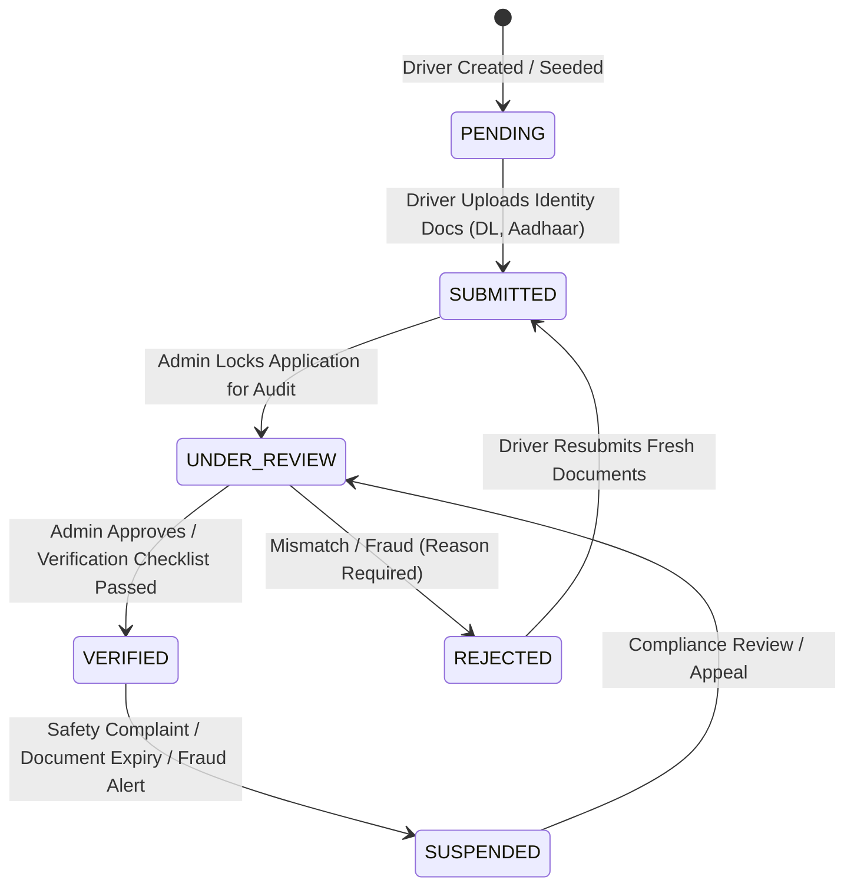

# NABIN — PHASE 16 IMPLEMENTATION PLAN (REVISED & FINALIZED)
## PostgreSQL-Authoritative Driver KYC, Verified Payout Destination, Partial Refund RPC & Atomic Cancellation Engine

**STATUS: PLAN-ONLY — NOT APPROVED — NO IMPLEMENTATION AUTHORIZED**  
**Document Version**: 2.1.0 — FINAL CLARIFIED ARCHITECTURAL SPECIFICATION  
**Target Repository**: `c:\Users\macmi\Documents\nabin`  
**Base Commit**: `8e18c216202cd8b0d00f0e6ff7f8e97821a7efd9` (Phase 14 Clean Baseline)  
**Target Migration**: `supabase/migrations/016_driver_kyc_payout_and_partial_refund.sql`  
**Governance Constraint**: Local development database only. Remote Supabase untouched. Application code, migrations 001–015, and git HEAD frozen.

---

## 1. EXECUTIVE SUMMARY & REVISION CONTEXT

Following the Phase 15 forensic audit and subsequent architectural clarifications, this document specifies the final, production-correct design for:
1. **Unlinked Driver Governance**: Existing drivers whose `drivers.user_id` cannot be safely linked to a pre-existing user account remain `user_id = NULL`. Unlinked drivers are strictly prohibited from authenticating as Driver App operators, toggling online, accepting dispatches, or receiving payouts until an explicit authenticated profile linkage occurs.
2. **Zero Fabricated Financial Handles**: Migration 016 strictly initializes `verified_upi_id = NULL` and `payout_upi_verified = FALSE` for all existing drivers. Drivers fail closed for payouts until an authentic verification workflow is executed.
3. **Zero Unearned Verification**: All existing drivers default strictly to `kyc_status = 'PENDING'`. No driver is upgraded to `VERIFIED` without an authentic, pre-existing review record in `identity_documents`.
4. **VPA Verification Taxonomy**: Clear architectural separation between `ADMIN_MANUAL` verification (Phase 16 administrative review) and future `BANK_PENNY_DROP` / `EXTERNAL_API` verification.
5. **Single Authoritative Financial Transaction**: Ride cancellation and refunds are consolidated into PostgreSQL-level ACID transactions (`cancel_ride_atomic` and upgraded `refund_payment_atomic`), eliminating multi-step failure windows and duplicate ledger postings.

---

## 2. REVISED SCHEMA & MIGRATION 016 DESIGN

Migration `supabase/migrations/016_driver_kyc_payout_and_partial_refund.sql` is a completely new file. Migrations `001–015` remain 100% byte-for-byte untouched.

### 2.1 Schema Additions in Migration 016

```sql
-- =========================================================================
-- NABIN PLATFORM — MIGRATION 016 (FINAL REVISION)
-- Domain: Driver KYC, Authoritative Payout Destination, Partial Refunds &
--         Atomic Ride Cancellation Engine
-- Baseline: Migrations 001–015 Unchanged
-- =========================================================================

-- 1. DRIVER → USER LINKAGE & PERSISTENT KYC / PAYOUT DESTINATION COLUMNS
ALTER TABLE drivers 
    ADD COLUMN IF NOT EXISTS user_id UUID REFERENCES users(id) ON DELETE SET NULL,
    ADD COLUMN IF NOT EXISTS kyc_status VARCHAR(30) DEFAULT 'PENDING' 
        CHECK (kyc_status IN ('PENDING', 'SUBMITTED', 'UNDER_REVIEW', 'VERIFIED', 'REJECTED', 'SUSPENDED')),
    ADD COLUMN IF NOT EXISTS verified_upi_id VARCHAR(100) DEFAULT NULL,
    ADD COLUMN IF NOT EXISTS pending_upi_id VARCHAR(100) DEFAULT NULL,
    ADD COLUMN IF NOT EXISTS upi_cooling_until TIMESTAMPTZ DEFAULT NULL,
    ADD COLUMN IF NOT EXISTS payout_upi_verified BOOLEAN DEFAULT FALSE,
    ADD COLUMN IF NOT EXISTS payout_upi_verified_at TIMESTAMPTZ DEFAULT NULL,
    ADD COLUMN IF NOT EXISTS vpa_verification_method VARCHAR(30) DEFAULT NULL 
        CHECK (vpa_verification_method IN ('ADMIN_MANUAL', 'BANK_PENNY_DROP', 'EXTERNAL_API')),
    ADD COLUMN IF NOT EXISTS kyc_verified_at TIMESTAMPTZ DEFAULT NULL,
    ADD COLUMN IF NOT EXISTS kyc_rejected_reason TEXT DEFAULT NULL;

CREATE INDEX IF NOT EXISTS idx_drivers_user_id ON drivers(user_id);
CREATE INDEX IF NOT EXISTS idx_drivers_kyc_status ON drivers(kyc_status);
CREATE INDEX IF NOT EXISTS idx_drivers_verified_upi ON drivers(verified_upi_id) WHERE verified_upi_id IS NOT NULL;

-- 2. SAFE CONSERVATIVE BACKFILL: LINK EXISTING DRIVERS ONLY WHERE MATCH EXISTS
-- Match based on normalized phone digits (digits only). Do NOT synthesize users.
UPDATE drivers d
SET user_id = u.id
FROM users u
WHERE regexp_replace(d.phone, '\D', '', 'g') = regexp_replace(u.phone, '\D', '', 'g')
  AND d.user_id IS NULL;

-- 3. CONSERVATIVE KYC STATUS BACKFILL: ONLY FROM AUTHORITATIVE IDENTITY DOCUMENTS
-- Default all drivers to 'PENDING'.
-- Only promote to 'VERIFIED' if a linked user has an authoritative, approved identity document.
UPDATE drivers d
SET kyc_status = 'VERIFIED',
    kyc_verified_at = doc.verified_at
FROM identity_documents doc
WHERE d.user_id IS NOT NULL 
  AND d.user_id = doc.user_id 
  AND doc.review_status = 'VERIFIED'
  AND d.kyc_status = 'PENDING';

-- NOTE: verified_upi_id REMAINS NULL AND payout_upi_verified REMAINS FALSE FOR ALL DRIVERS.
-- Zero financial destinations are fabricated in this migration.

-- 4. PAYMENTS TABLE: PARTIAL REFUND SUPPORT & CUMULATIVE BALANCE TRACKING
ALTER TABLE payments 
    ADD COLUMN IF NOT EXISTS refunded_amount NUMERIC(12, 2) DEFAULT 0.00 CHECK (refunded_amount >= 0);

-- Update status check constraint safely
ALTER TABLE payments DROP CONSTRAINT IF EXISTS payments_status_check;
ALTER TABLE payments ADD CONSTRAINT payments_status_check 
    CHECK (status IN ('INITIATED', 'PENDING', 'CAPTURED', 'FAILED', 'PARTIALLY_REFUNDED', 'REFUNDED'));

-- 5. JOBS TABLE: CANCELLATION FINANCIAL METADATA COLUMNS
ALTER TABLE jobs
    ADD COLUMN IF NOT EXISTS cancellation_fee NUMERIC(10, 2) DEFAULT 0.00,
    ADD COLUMN IF NOT EXISTS driver_compensation NUMERIC(10, 2) DEFAULT 0.00,
    ADD COLUMN IF NOT EXISTS refund_amount NUMERIC(10, 2) DEFAULT 0.00,
    ADD COLUMN IF NOT EXISTS refund_status VARCHAR(30) DEFAULT 'NONE'
        CHECK (refund_status IN ('NONE', 'REFUNDED', 'PARTIALLY_REFUNDED', 'FEE_OFFSET', 'NOT_APPLICABLE')),
    ADD COLUMN IF NOT EXISTS cancelled_by_role VARCHAR(20) DEFAULT NULL;
```

---

## 3. DRIVER ↔ USER RELATIONSHIP & STRICT DISPATCH ENFORCEMENT

### 3.1 Final Decision on Unlinked Drivers (`drivers.user_id IS NULL`)
In accordance with zero-trust architectural principles, **an unlinked legacy driver cannot operate as a Driver App user**.

```text
       Driver App Authentication / Operation
                        │
                        ▼
          [Is drivers.user_id NOT NULL?]
           ├── NO  ──► REJECTED (HTTP 403: UNLINKED_DRIVER_ACCOUNT)
           │           - Cannot toggle online
           │           - Cannot accept dispatch
           │           - Cannot request payouts
           │
           └── YES ──► Eligible for Driver App Dispatch Operations
                        │
                        ▼
          [Is Payout Requested?]
           ├── Requires: kyc_status = 'VERIFIED'
           │             AND verified_upi_id IS NOT NULL
           │             AND payout_upi_verified = TRUE
           └── If any condition fails ──► REJECTED (HTTP 403)
```

1. **Migration 016 Rules**:
   - Migration 016 **MUST NOT** manufacture replacement user records.
   - Migration 016 deterministically links an existing driver to an existing user only when normalized phone numbers match unambiguously.
   - If no safe user match exists, `drivers.user_id` **remains NULL**.
   - Legacy driver records are **NOT deleted**.
2. **Account Linking Protocol**:
   - Legacy drivers with `user_id = NULL` require a future authenticated OTP account-linking workflow to associate with a legitimate user account.

### 3.2 Exact Dispatch & Authentication Enforcement Points

Inspection of `backend/src/server.js` identifies the exact location where `drivers.user_id IS NOT NULL` must be enforced:

#### Primary Enforcement Point: `authenticateDriver` Middleware (`backend/src/server.js:319`)
- **Location**: In `server.js` line 340, immediately after resolving the driver entity:
  ```javascript
  const driver = db.getDriver(session.entityId) || session.entity;
  ```
- **Check to be Implemented (Post-Approval)**:
  ```javascript
  if (!driver.userId && !driver.user_id) {
    return res.status(403).json({
      success: false,
      error: 'Forbidden: Driver profile is not linked to an active user account. Account linkage required before Driver App operations.',
      code: 'UNLINKED_DRIVER_ACCOUNT',
      requestId: req.id
    });
  }
  ```
- **Scope of Protection**: Because `authenticateDriver` guards all driver operational endpoints, this single check completely locks:
  1. `POST /api/driver/:driverId/toggle-online` (Driver cannot go online)
  2. `GET /api/driver/:driverId/dashboard` (Driver cannot access dashboard telemetry)
  3. `POST /api/driver/accept-job` (Driver cannot accept dispatches)
  4. `POST /api/driver/complete-trip` (Driver cannot complete trips)
  5. `POST /api/driver/payout` (Driver cannot request payouts)
  6. `GET /api/driver/:driverId/earnings` (Driver cannot view earnings)
- **Secondary Dispatch Enforcement**: In `POST /api/driver/accept-job` (`server.js:2447`), an explicit check verifies `driver.user_id IS NOT NULL` and `driver.operationalStatus === 'AVAILABLE'`.
- **Behavior of Existing Driver Sessions**: Sessions associated with an unlinked driver token will receive an immediate `HTTP 403 Forbidden` (`code: UNLINKED_DRIVER_ACCOUNT`) and fail closed.

---

## 4. PERSISTENT KYC STATE MACHINE

### 4.1 State Hierarchy & Transitions


### 4.2 Transition Rules
- **Conservative Backfill**: Migration 016 defaults all existing drivers to `PENDING`. Only drivers with an authentic, pre-existing `identity_documents` record marked `VERIFIED` are promoted to `VERIFIED`.
- **Runtime Hydration**: `DriverRepository.js` and `database.js` read `row.kyc_status` directly from PostgreSQL. All hardcoded `kycStatus: 'VERIFIED'` code is removed.
- **Enforcement**: Transitions to `VERIFIED`, `REJECTED`, or `SUSPENDED` require `authenticateAdmin` with `kyc.review` permission and write immutable audit logs.

---

## 5. VERIFIED PAYOUT DESTINATION LIFECYCLE & TAXONOMY

### 5.1 Verification Taxonomy: Admin Manual vs Bank API
The architecture distinguishes between administrative verification and automated banking validation:
- `ADMIN_MANUAL`: Phase 16 operational baseline where an administrator reviews bank proof / passbook / cancelled cheque and marks the VPA verified via `POST /api/admin/drivers/:id/verify-payout-destination`.
- `BANK_PENNY_DROP`: Future automated validation via NPCI / Razorpay Fund Account Validation / Cashfree Penny Drop.
- `EXTERNAL_API`: Third-party webhook or open-banking callback.

Stored in `drivers.vpa_verification_method VARCHAR(30)`.

### 5.2 Destination Rules & Fail-Closed Guard
1. **Zero Synthetic Handles**: Migration 016 sets `verified_upi_id = NULL` and `payout_upi_verified = FALSE`. The application never synthesizes `${phone}@okhdfcbank`.
2. **Client Ignored**: `POST /api/driver/payout` completely ignores any `req.body.upiId`. Destination is derived exclusively from `drivers.verified_upi_id`.
3. **Fail-Closed Gate**: Payout fails closed with `HTTP 403 Forbidden` if `verified_upi_id` is null, `payout_upi_verified` is false, `kyc_status` is not `VERIFIED`, or `upi_cooling_until > NOW()`.
4. **Cooling-Off Period**: Changing a destination triggers a 24-hour cooling period where payouts to the new destination are blocked.

---

## 6. PARTIAL REFUND STATE MACHINE & RPC DESIGN

### 6.1 RPC Specification: `refund_payment_atomic`
In Migration 016, `refund_payment_atomic` is upgraded to support both full and partial refunds with cumulative balance validation.

```sql
CREATE OR REPLACE FUNCTION refund_payment_atomic(
    p_order_or_payment TEXT,
    p_refund_event_id  TEXT,
    p_reason           TEXT DEFAULT NULL,
    p_authorized_by    TEXT DEFAULT 'SUPPORT_AGENT',
    p_provider         TEXT DEFAULT 'RAZORPAY_SANDBOX',
    p_declared_amount  NUMERIC DEFAULT NULL
) RETURNS JSON
LANGUAGE plpgsql
SECURITY DEFINER
SET search_path = public AS $$
DECLARE
    v_pay             payments%ROWTYPE;
    v_event_id        TEXT;
    v_ledger_id       TEXT;
    v_refund_amount   NUMERIC(12, 2);
    v_new_refunded    NUMERIC(12, 2);
    v_new_status      VARCHAR(30);
    v_refundable_left NUMERIC(12, 2);
BEGIN
    -- 1. Acquire exclusive row lock on canonical payment record
    SELECT * INTO v_pay FROM payments
     WHERE payment_id = p_order_or_payment OR gateway_order_id = p_order_or_payment
     FOR UPDATE;
    IF NOT FOUND THEN
        RETURN json_build_object('success', false, 'code', 'PAYMENT_NOT_FOUND');
    END IF;

    -- 2. Enforce Terminal State Protection
    IF v_pay.status = 'REFUNDED' THEN
        RETURN json_build_object('success', true, 'duplicate', true,
                                 'paymentId', v_pay.payment_id,
                                 'status', 'REFUNDED',
                                 'message', 'Payment is already fully refunded.');
    END IF;
    IF v_pay.status NOT IN ('CAPTURED', 'PARTIALLY_REFUNDED') THEN
        RETURN json_build_object('success', false, 'code', 'INVALID_STATE',
                                 'status', v_pay.status);
    END IF;

    -- 3. Calculate and Validate Refund Amount
    v_refundable_left := v_pay.amount - COALESCE(v_pay.refunded_amount, 0.00);
    IF p_declared_amount IS NOT NULL THEN
        v_refund_amount := ROUND(p_declared_amount::NUMERIC, 2);
    ELSE
        v_refund_amount := v_refundable_left;
    END IF;

    IF v_refund_amount <= 0.00 THEN
        RETURN json_build_object('success', false, 'code', 'INVALID_REFUND_AMOUNT',
                                 'amount', v_refund_amount);
    END IF;

    IF v_refund_amount > v_refundable_left THEN
        RETURN json_build_object('success', false, 'code', 'EXCEEDS_REFUNDABLE_BALANCE',
                                 'requested', v_refund_amount,
                                 'remaining', v_refundable_left);
    END IF;

    v_new_refunded := COALESCE(v_pay.refunded_amount, 0.00) + v_refund_amount;
    IF v_new_refunded >= v_pay.amount THEN
        v_new_status := 'REFUNDED';
    ELSE
        v_new_status := 'PARTIALLY_REFUNDED';
    END IF;

    -- 4. Durable Idempotency Claim via payment_webhooks.event_id UNIQUE constraint
    v_event_id := COALESCE(p_refund_event_id, 'evt_ref_' || v_pay.payment_id || '_' || extract(epoch from now())::bigint);
    BEGIN
        INSERT INTO payment_webhooks(event_id, event_type, provider, payment_id, amount,
                                     status, payload, is_processed, processed_at, signature_valid)
        VALUES (v_event_id, 'refund.processed', p_provider, v_pay.payment_id,
                v_refund_amount, 'PROCESSED',
                jsonb_build_object('order_id', v_pay.gateway_order_id,
                                   'reason', p_reason, 'authorized_by', p_authorized_by,
                                   'previous_status', v_pay.status, 'new_status', v_new_status),
                true, now(), true);
    EXCEPTION WHEN unique_violation THEN
        RETURN json_build_object('success', true, 'duplicate', true,
                                 'paymentId', v_pay.payment_id,
                                 'eventId', v_event_id);
    END;

    -- 5. Single Authoritative Ledger Reversal Row (Immutable Double-Entry)
    v_ledger_id := 'LEDGR-' || substr(md5(v_event_id), 1, 31);
    INSERT INTO ledger_entries(entry_id, category, debit_account, credit_account, amount,
                               currency, job_id, description, reference_id)
    VALUES (v_ledger_id, 'DISPUTE_REFUND',
            'CUSTOMER_WALLET_LIABILITY',
            'PAYMENT_GATEWAY_ESCROW',
            v_refund_amount, COALESCE(v_pay.currency, 'INR'),
            v_pay.job_id, 'Atomic refund [' || COALESCE(p_reason, 'unspecified') || ']',
            COALESCE(v_pay.gateway_order_id, v_pay.payment_id));

    -- 6. Mutate Payment Record
    UPDATE payments 
       SET status = v_new_status,
           refunded_amount = v_new_refunded,
           refunded_at = now(),
           updated_at = now()
     WHERE id = v_pay.id;

    RETURN json_build_object(
        'success', true,
        'duplicate', false,
        'paymentId', v_pay.payment_id,
        'refundAmount', v_refund_amount,
        'totalRefunded', v_new_refunded,
        'status', v_new_status,
        'eventId', v_event_id
    );
END;
$$;
```

---

## 7. CANCELLATION FINANCIAL ARCHITECTURE & BUSINESS RULES

### 7.1 Authoritative Business Rule Matrix
| Trip State | Payment Method | Assignment Time Elapsed | Fee Assessed | Customer Wallet Refund | Driver Compensation | Payment Table Status |
| :--- | :--- | :--- | :--- | :--- | :--- | :--- |
| **Unassigned** | Prepaid / Online | N/A | ₹0.00 | 100% of Fare Paid | ₹0.00 | `REFUNDED` |
| **Assigned** | Prepaid / Online | **<= 2 minutes** | ₹0.00 | 100% of Fare Paid | ₹0.00 | `REFUNDED` |
| **Assigned** | Prepaid / Online | **> 2 minutes** | **₹50.00** | **`Fare - ₹50.00`** | **₹40.00** | `PARTIALLY_REFUNDED` |
| **Any** | Cash / Unpaid | Any | ₹0.00 | ₹0.00 | ₹0.00 | `UNPAID` (No change) |
| **Completed** | Any | Any | N/A | Aborted (400) | N/A | Unchanged |
| **Already Cancelled** | Any | Any | N/A | Idempotent (200) | N/A | Unchanged |

*Note on 2-Minute Boundary*: Elapsed time is computed as `EXTRACT(EPOCH FROM (now() - job.assigned_at)) / 60.0`. Exact boundary condition: `<= 2.000` minutes qualifies for 100% refund; `> 2.000` minutes assesses the ₹50.00 cancellation fee.

### 7.2 Single-Transaction Cancellation RPC: `cancel_ride_atomic`

```sql
CREATE OR REPLACE FUNCTION cancel_ride_atomic(
    p_job_id              UUID,
    p_requester_id        UUID,
    p_requester_role      VARCHAR(20),
    p_reason              TEXT,
    p_is_delayed_override BOOLEAN DEFAULT FALSE
) RETURNS JSON
LANGUAGE plpgsql
SECURITY DEFINER
SET search_path = public AS $$
DECLARE
    v_job                 jobs%ROWTYPE;
    v_pay                 payments%ROWTYPE;
    v_elapsed_minutes     NUMERIC;
    v_assigned_time       TIMESTAMPTZ;
    v_fee_applies         BOOLEAN := FALSE;
    v_fee_amount          NUMERIC(10, 2) := 0.00;
    v_driver_comp         NUMERIC(10, 2) := 0.00;
    v_refund_amount       NUMERIC(10, 2) := 0.00;
    v_is_paid             BOOLEAN := FALSE;
    v_refund_status       VARCHAR(30) := 'NONE';
    v_cust_bal_after      NUMERIC(10, 2);
    v_drv_bal_after       NUMERIC(10, 2);
    v_ref_res             JSON;
BEGIN
    -- 1. Acquire exclusive lock on the job row (Serializes concurrent cancellations)
    SELECT * INTO v_job FROM jobs WHERE id = p_job_id FOR UPDATE;
    IF NOT FOUND THEN
        RETURN json_build_object('success', false, 'code', 'JOB_NOT_FOUND');
    END IF;

    -- 2. Terminal checks
    IF v_job.status = 'CANCELLED' THEN
        RETURN json_build_object('success', true, 'duplicate', true, 'message', 'Trip already cancelled.');
    END IF;
    IF v_job.status = 'COMPLETED' THEN
        RETURN json_build_object('success', false, 'code', 'JOB_ALREADY_COMPLETED');
    END IF;

    -- 3. Authorization check
    IF p_requester_role = 'CUSTOMER' AND v_job.customer_id <> p_requester_id THEN
        RETURN json_build_object('success', false, 'code', 'FORBIDDEN_NOT_OWNER');
    END IF;

    -- 4. Check payment state
    SELECT * INTO v_pay FROM payments WHERE job_id = p_job_id ORDER BY created_at DESC LIMIT 1 FOR UPDATE;
    v_is_paid := (FOUND AND v_pay.status = 'CAPTURED');

    -- 5. Evaluate Cancellation Fee & Compensation
    IF v_job.driver_id IS NOT NULL THEN
        v_assigned_time := COALESCE(v_job.assigned_at, v_job.created_at);
        v_elapsed_minutes := EXTRACT(EPOCH FROM (now() - v_assigned_time)) / 60.0;
        IF p_is_delayed_override OR v_elapsed_minutes > 2.0 THEN
            v_fee_applies := TRUE;
            v_fee_amount := 50.00;
            v_driver_comp := 40.00;
        END IF;
    END IF;

    -- 6. Customer Wallet Refund (Internal Transactional Mutation)
    IF v_is_paid THEN
        v_refund_amount := GREATEST(0.00, v_pay.amount - v_fee_amount);
        IF v_refund_amount > 0.00 THEN
            -- Credit customer wallet
            UPDATE users 
               SET wallet_balance = wallet_balance + v_refund_amount, updated_at = now()
             WHERE id = v_job.customer_id
             RETURNING wallet_balance INTO v_cust_bal_after;

            -- Flip payment status via internal partial refund RPC
            v_ref_res := refund_payment_atomic(
                v_pay.payment_id,
                'evt_cancel_ref_' || v_job.id,
                'Automated refund for cancelled trip: ' || COALESCE(p_reason, 'Customer cancelled'),
                p_requester_role,
                'RAZORPAY_SANDBOX',
                v_refund_amount
            );
            v_refund_status := (v_ref_res->>'status');
        ELSE
            v_refund_status := 'FEE_OFFSET';
        END IF;
    ELSE
        v_refund_status := 'NOT_APPLICABLE';
    END IF;

    -- 7. Driver Compensation (Internal Transactional Mutation)
    IF v_driver_comp > 0.00 AND v_job.driver_id IS NOT NULL THEN
        UPDATE drivers 
           SET wallet_balance = wallet_balance + v_driver_comp,
               operational_status = 'AVAILABLE',
               is_online = true
         WHERE id = v_job.driver_id
         RETURNING wallet_balance INTO v_drv_bal_after;

        -- Record authoritative double-entry ledger entry for driver compensation
        INSERT INTO ledger_entries(entry_id, category, debit_account, credit_account, amount,
                                   currency, job_id, description, reference_id)
        VALUES ('LEDGR-CMP-' || substr(md5(v_job.id::text || now()::text), 1, 22),
                'RIDE_SETTLEMENT', 'PLATFORM_REVENUE', 'DRIVER_EARNINGS_PAYABLE',
                v_driver_comp, 'INR', v_job.id, 'Cancellation compensation for trip ' || v_job.id, v_job.id::text);
    ELSIF v_job.driver_id IS NOT NULL THEN
        UPDATE drivers SET operational_status = 'AVAILABLE', is_online = true WHERE id = v_job.driver_id;
    END IF;

    -- 8. Promotion Count Restoration
    IF v_job.metadata ? 'promo_code' THEN
        UPDATE promotions 
           SET usage_count = GREATEST(0, usage_count - 1), updated_at = now()
         WHERE code = (v_job.metadata->>'promo_code');
    END IF;

    -- 9. Mutate Job State
    UPDATE jobs
       SET status = 'CANCELLED',
           cancellation_fee = v_fee_amount,
           driver_compensation = v_driver_comp,
           refund_amount = v_refund_amount,
           refund_status = v_refund_status,
           cancelled_by_role = p_requester_role,
           metadata = jsonb_set(COALESCE(metadata, '{}'::jsonb), '{cancellation}', jsonb_build_object(
               'reason', p_reason,
               'fee', v_fee_amount,
               'driverComp', v_driver_comp,
               'refundAmount', v_refund_amount,
               'cancelledAt', now()
           )),
           updated_at = now()
     WHERE id = v_job.id;

    -- 10. Record Immutable Audit Event
    INSERT INTO audit_logs(admin_id, admin_name, role, action, module,
                           target_entity_type, target_entity_id, reason, metadata)
    VALUES (p_requester_id::text, 'Cancellation Engine', p_requester_role,
            'RIDE_CANCELLED', 'DISPATCH', 'JOB', v_job.id::text,
            p_reason, jsonb_build_object('fee', v_fee_amount, 'refund', v_refund_amount, 'driverComp', v_driver_comp));

    RETURN json_build_object(
        'success', true,
        'jobId', v_job.id,
        'status', 'CANCELLED',
        'cancellationFee', v_fee_amount,
        'driverCompensation', v_driver_comp,
        'refundAmount', v_refund_amount,
        'refundStatus', v_refund_status,
        'customerWalletBalance', v_cust_bal_after,
        'driverWalletBalance', v_drv_bal_after
    );
END;
$$;
```

---

## 8. EXACT LEDGER ACCOUNTING SEMANTICS

All accounts correspond strictly to `001_central_schema.sql` and `002_finance_ledger_schema.sql`.

| Operation | Debit Account | Credit Account | Amount | Idempotency Key / Ref | Authoritative Writer |
| :--- | :--- | :--- | :--- | :--- | :--- |
| **Payment Capture** | `PAYMENT_GATEWAY_ESCROW` | `CUSTOMER_WALLET_LIABILITY` | Fare Captured | `evt_cap_{orderId}` | `capture_payment_atomic` |
| **Customer Refund** | `CUSTOMER_WALLET_LIABILITY` | `PAYMENT_GATEWAY_ESCROW` | Net Refund Amount | `evt_cancel_ref_{jobId}` | `refund_payment_atomic` |
| **Driver Compensation** | `PLATFORM_REVENUE` | `DRIVER_EARNINGS_PAYABLE` | ₹40.00 | `LEDGR-CMP-{jobId}` | `cancel_ride_atomic` |
| **Platform Fee Retained** | Retained in Platform Escrow / Revenue | - | ₹10.00 | Offset in Clearing | N/A (Net Escrow Surplus) |
| **Driver Payout Disbursed** | `DRIVER_EARNINGS_PAYABLE` | `PAYMENT_GATEWAY_ESCROW` | Payout Amount | `payout_id` | `adjust_wallet_atomic` |

**Elimination of Triplicate Accounting**:
`POST /api/admin/finance/refund` in `server.js` will invoke `refund_payment_atomic` as the **sole** financial writer. `db.recordLedgerEntry()` calls in Node.js are deleted.

---

## 9. CONCURRENCY, LOCKING & IDEMPOTENCY

1. **Serialization via Row Locking**:
   - `cancel_ride_atomic` acquires `SELECT ... FROM jobs WHERE id = p_job_id FOR UPDATE`.
   - Any secondary concurrent request blocks. When released, it detects `status = 'CANCELLED'` and exits immediately without duplicate wallet credit.
2. **Payment Row Serialization**:
   - `refund_payment_atomic` locks `payments` row (`FOR UPDATE`).
   - Two parallel refund requests are evaluated sequentially; the second request sees `refunded_amount` already updated.
3. **Idempotency Persistence**:
   - Webhook events: `payment_webhooks.event_id UNIQUE`.
   - Driver payouts: `driver_payouts.idempotency_key UNIQUE`.
   - Ledger entries: `ledger_entries.entry_id UNIQUE`.

---

## 10. RBAC RECTIFICATION & DUPLICATE ROUTE ELIMINATION

### Problem in `server.js`:
- Line 859: Shadow route `app.post('/api/admin/drivers/:id/status')` lacked permission check and updated in-memory array.
- Line 2397: Protected route `app.post('/api/admin/drivers/:id/status', authenticateAdmin, requirePermission('fleet.manage'))` was never reached.

### Fix Specification:
1. **Delete** line 859 route definition entirely.
2. **Retain** line 2397 route definition, upgrading it to:
   - Enforce `requirePermission('fleet.manage')`.
   - Call `db.driverRepo.updateDriverStatus(id, { operationalStatus, kycStatus })`, writing directly to PostgreSQL.
   - Record authoritative audit event via `db.createAuditLog()`.

---

## 11. EXACT FILES EXPECTED TO CHANGE (POST-APPROVAL)

| File Path | Action | Scope of Modifications |
| :--- | :--- | :--- |
| `supabase/migrations/016_driver_kyc_payout_and_partial_refund.sql` | **[NEW]** | Schema additions for `drivers`, `payments`, `jobs`; `refund_payment_atomic` upgrade; `cancel_ride_atomic` RPC. |
| `backend/src/repositories/DriverRepository.js` | **[MODIFY]** | Remove hardcoded `'VERIFIED'`; map `row.kyc_status` and `row.verified_upi_id` from PostgreSQL; implement `updateDriverStatus` and `verifyPayoutDestination`. |
| `backend/src/database.js` | **[MODIFY]** | Remove synthetic `${phone}@okhdfcbank` generator; bind `resolveVerifiedUpiId` strictly to `driver.verifiedUpiId`. |
| `backend/src/repositories/PaymentRepository.js` | **[MODIFY]** | Remove duplicate audit writes; support partial refund parameters. |
| `backend/src/server.js` | **[MODIFY]** | Enforce `driver.user_id IS NOT NULL` in `authenticateDriver`; delete shadow route at line 859; update cancellation endpoint to call `cancel_ride_atomic`; eliminate redundant ledger calls in admin refund. |
| `backend/test_suite.js` | **[MODIFY]** | Replace in-memory false-positive tests with genuine PostgreSQL persistence assertions, concurrent cancellation tests, and partial refund tests. |
| `backend/restart_test.js` | **[MODIFY]** | Assert driver KYC status and verified VPA survive server cold restart. |

---

## 12. COMPREHENSIVE TEST PLAN

### Module 28: PostgreSQL KYC & Payout Destination Suite
- `TEST-KYC-01`: Driver seeded with `kyc_status = 'PENDING'` defaults to `PENDING` across restarts.
- `TEST-KYC-02`: Admin transitions driver status to `VERIFIED` via canonical endpoint; verifies PostgreSQL persistence.
- `TEST-KYC-03`: Payout request fails with HTTP 403 when `kyc_status` is `PENDING` or `REJECTED`.
- `TEST-VPA-01`: Payout fails with HTTP 403 when driver has no verified VPA (`verified_upi_id = NULL`).
- `TEST-VPA-02`: Client-supplied `upiId` is ignored; server binds strictly to database `verified_upi_id`.
- `TEST-VPA-03`: Verified VPA survives server termination and cold restart.
- `TEST-DRV-AUTH-01`: Driver with `user_id = NULL` is rejected with `HTTP 403 (UNLINKED_DRIVER_ACCOUNT)` across all Driver App operations.

### Module 29: Partial Refund & Cancellation Suite
- `TEST-REF-01`: Partial refund of ₹55 on ₹105 capture transitions status to `PARTIALLY_REFUNDED` and tracks `refunded_amount = 55.00`.
- `TEST-REF-02`: Subsequent refund of remaining ₹50 transitions status to `REFUNDED`.
- `TEST-REF-03`: Over-refund request (> remaining balance) is rejected with `EXCEEDS_REFUNDABLE_BALANCE`.
- `TEST-REF-04`: Duplicate refund request returns cached idempotent result without double ledger posting.
- `TEST-CNC-01`: Early cancellation (<2 min) yields 100% wallet refund, ₹0 fee, ₹0 driver compensation.
- `TEST-CNC-02`: Delayed cancellation (>2 min) yields `fare - ₹50` refund, ₹40 driver compensation, ₹10 platform fee, and `PARTIALLY_REFUNDED` status.
- `TEST-CNC-03`: Concurrent cancellations on the same trip execute safely without double-refunding wallet.
- `TEST-RBAC-01`: Unauthenticated or non-fleet admin rejected from `/api/admin/drivers/:id/status`. Shadow route confirmed removed.

---

## 13. MIGRATION SAFETY & ROLLBACK PLAN

- **Non-Destructive**: All schema additions use `ADD COLUMN IF NOT EXISTS`.
- **Constraint Safety**: Check constraints are dropped and re-added idempotently.
- **Rollback SQL**:
  ```sql
  ALTER TABLE drivers DROP COLUMN IF EXISTS kyc_status, DROP COLUMN IF EXISTS verified_upi_id, DROP COLUMN IF EXISTS user_id, DROP COLUMN IF EXISTS vpa_verification_method;
  ALTER TABLE payments DROP COLUMN IF EXISTS refunded_amount;
  DROP FUNCTION IF EXISTS cancel_ride_atomic;
  -- Restore 006 version of refund_payment_atomic if needed
  ```
- **Local Dev Only**: Applied locally via `psql` or Supabase CLI. Remote Supabase untouched.

---

## 14. REMAINING ASSUMPTIONS & DESIGN QUESTIONS

1. **Banking VPA Verification Integration**:
   - *Current State*: Handled via `ADMIN_MANUAL` review (`POST /api/admin/drivers/:id/verify-payout-destination`) in Phase 16.
   - *Design Decision*: Schema explicitly includes `vpa_verification_method` (`ADMIN_MANUAL`, `BANK_PENNY_DROP`, `EXTERNAL_API`) to seamlessly accommodate external banking APIs in future phases.
2. **Unlinked Legacy Drivers**:
   - *Current State*: Unlinked drivers (`drivers.user_id IS NULL`) are completely blocked from authenticating, going online, accepting dispatches, and receiving payouts.
   - *Design Decision*: Legacy driver records remain in PostgreSQL for historical reference; an authenticated OTP profile-linking endpoint can be introduced in a future sprint to link them to verified user profiles.

---

## 15. ABSOLUTE STOP CONDITION

**Repository Status**: FROZEN. Baseline `8e18c21` preserved. Zero remote changes.  
**STATUS: PLAN-ONLY — NOT APPROVED — NO IMPLEMENTATION AUTHORIZED**
